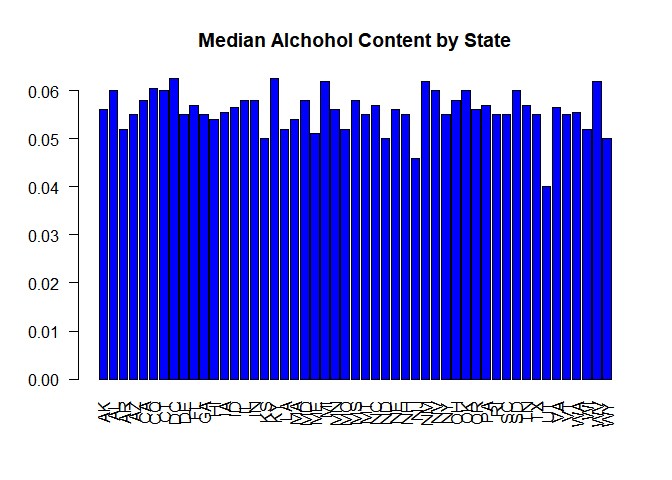

## Introduction

The purpose of this documentaton is to provide analysis answers to questions asked by you (the client) related to several different Beers and the Breweries that produce them.

The Environment Information section describes the  software environment and repository location of the data files and code. You should refer to this information should you desire to reproduce this analysis. 

Each subsequent section contains (in order) :  

* A particular question you have asked  

* Methods we used to analyze the data you provided  

* The answer to the question  

---  

##1. Environment Information  

>  This code block clears the R environment and loads the libraries required to process the subsequent code.  


```r
rm(list = ls())
library(ggplot2)
library(readr)
library(bitops)
library(plyr)
```
> This code block displays the hardware, software and thier versions.  


```r
sessionInfo()
```

```
## R version 3.4.3 (2017-11-30)
## Platform: x86_64-w64-mingw32/x64 (64-bit)
## Running under: Windows 10 x64 (build 16299)
## 
## Matrix products: default
## 
## locale:
## [1] LC_COLLATE=English_United States.1252 
## [2] LC_CTYPE=English_United States.1252   
## [3] LC_MONETARY=English_United States.1252
## [4] LC_NUMERIC=C                          
## [5] LC_TIME=English_United States.1252    
## 
## attached base packages:
## [1] stats     graphics  grDevices utils     datasets  methods   base     
## 
## other attached packages:
## [1] plyr_1.8.4    bitops_1.0-6  readr_1.1.1   ggplot2_2.2.1
## 
## loaded via a namespace (and not attached):
##  [1] Rcpp_0.12.14     knitr_1.17       magrittr_1.5     hms_0.4.0       
##  [5] munsell_0.4.3    colorspace_1.3-2 R6_2.2.2         rlang_0.1.6     
##  [9] stringr_1.2.0    tools_3.4.3      grid_3.4.3       gtable_0.2.0    
## [13] htmltools_0.3.6  yaml_2.1.16      lazyeval_0.2.1   rprojroot_1.3-1 
## [17] digest_0.6.13    tibble_1.4.2     formatR_1.5      evaluate_0.10.1 
## [21] rmarkdown_1.8    stringi_1.1.6    compiler_3.4.3   pillar_1.1.0    
## [25] scales_0.5.0     backports_1.1.2  pkgconfig_2.0.1
```

[Link to the Github Repository Associated with this Study](https://github.com/davxdan/MSDS_6306_DoingDataScience_Case-Study_01)

--- 

###1. How many breweries are present in each state?

#### Loading the Provided Data


```r
# Load Beers.csv
RawBeerData <- read_csv("Input/RawDataFiles/Beers.csv")
```

```
## Parsed with column specification:
## cols(
##   Name = col_character(),
##   Beer_ID = col_integer(),
##   ABV = col_double(),
##   IBU = col_integer(),
##   Brewery_id = col_integer(),
##   Style = col_character(),
##   Ounces = col_double()
## )
```

```r
# Load Breweries.csv
RawBreweryData <- read_csv("Input/RawDataFiles/Breweries.csv")
```

```
## Parsed with column specification:
## cols(
##   Brew_ID = col_integer(),
##   Name = col_character(),
##   City = col_character(),
##   State = col_character()
## )
```
#### Examining the Provided Data
We examined the data using [OpenRefine](http://openrefine.org/) and other tools.  

We identified some records in the data files that raised concerns. For example the record (110,"Woodstock Inn, Station & Brewery",North Woodstock, NH) could potentially cause parsing errors however using the readr package mitigated this.


```r
# Display the potentially troublesome records
RawBreweryData[c(110, 111, 112), ]
```

```
## # A tibble: 3 x 4
##   Brew_ID Name                             City            State
##     <int> <chr>                            <chr>           <chr>
## 1     110 Woodstock Inn, Station & Brewery North Woodstock NH   
## 2     111 Renegade Brewing Company         Denver          CO   
## 3     112 Mother Earth Brew Company        Vista           CA
```

```r
# Load the raw data into a working dataframe. We want to preserve the raw
# data just in case we need it later.
Stage1BreweryData <- RawBreweryData
# Convert the State column to character and isolate it so we can summarise
# it to get the counts by state. There are other ways to do this but this
# was simplest.
Stage1BreweryData <- transform(Stage1BreweryData, State = as.character(State))
CountBreweriesByState <- data.frame(Stage1BreweryData$State)
```
> Answer 1  

The count of Breweries by state are listed below:

```r
summary(CountBreweriesByState, maxsum = 100)
```

```
##  Stage1BreweryData.State
##  AK: 7                  
##  AL: 3                  
##  AR: 2                  
##  AZ:11                  
##  CA:39                  
##  CO:47                  
##  CT: 8                  
##  DC: 1                  
##  DE: 2                  
##  FL:15                  
##  GA: 7                  
##  HI: 4                  
##  IA: 5                  
##  ID: 5                  
##  IL:18                  
##  IN:22                  
##  KS: 3                  
##  KY: 4                  
##  LA: 5                  
##  MA:23                  
##  MD: 7                  
##  ME: 9                  
##  MI:32                  
##  MN:12                  
##  MO: 9                  
##  MS: 2                  
##  MT: 9                  
##  NC:19                  
##  ND: 1                  
##  NE: 5                  
##  NH: 3                  
##  NJ: 3                  
##  NM: 4                  
##  NV: 2                  
##  NY:16                  
##  OH:15                  
##  OK: 6                  
##  OR:29                  
##  PA:25                  
##  RI: 5                  
##  SC: 4                  
##  SD: 1                  
##  TN: 3                  
##  TX:28                  
##  UT: 4                  
##  VA:16                  
##  VT:10                  
##  WA:23                  
##  WI:20                  
##  WV: 1                  
##  WY: 4
```
###2. Merge beer data with the breweries data. Print the first 6 observations and the last six observations to check the merged file.

```r
# Adjust the column names so we can merge brewery data with beers data on
# 'Brewery_id'.
colnames(Stage1BreweryData) <- c("Brewery_id", "BreweryName", "City", "State")
# Merge the data
Stage2 <- merge(x = RawBeerData, y = Stage1BreweryData, by = c("Brewery_id"), 
    all = FALSE)
```
> Answer 2  

Below are the first and last six records of the resulting joined data:  

```r
# display the first 6 rows
head(Stage2)
```

```
##   Brewery_id          Name Beer_ID   ABV IBU
## 1          1  Get Together    2692 0.045  50
## 2          1 Maggie's Leap    2691 0.049  26
## 3          1    Wall's End    2690 0.048  19
## 4          1       Pumpion    2689 0.060  38
## 5          1    Stronghold    2688 0.060  25
## 6          1   Parapet ESB    2687 0.056  47
##                                 Style Ounces       BreweryName        City
## 1                        American IPA     16 NorthGate Brewing Minneapolis
## 2                  Milk / Sweet Stout     16 NorthGate Brewing Minneapolis
## 3                   English Brown Ale     16 NorthGate Brewing Minneapolis
## 4                         Pumpkin Ale     16 NorthGate Brewing Minneapolis
## 5                     American Porter     16 NorthGate Brewing Minneapolis
## 6 Extra Special / Strong Bitter (ESB)     16 NorthGate Brewing Minneapolis
##   State
## 1    MN
## 2    MN
## 3    MN
## 4    MN
## 5    MN
## 6    MN
```

```r
# display the last 6 rows
tail(Stage2)
```

```
##      Brewery_id                      Name Beer_ID   ABV IBU
## 2405        556             Pilsner Ukiah      98 0.055  NA
## 2406        557  Heinnieweisse Weissebier      52 0.049  NA
## 2407        557           Snapperhead IPA      51 0.068  NA
## 2408        557         Moo Thunder Stout      50 0.049  NA
## 2409        557         Porkslap Pale Ale      49 0.043  NA
## 2410        558 Urban Wilderness Pale Ale      30 0.049  NA
##                        Style Ounces                   BreweryName
## 2405         German Pilsener     12         Ukiah Brewing Company
## 2406              Hefeweizen     12       Butternuts Beer and Ale
## 2407            American IPA     12       Butternuts Beer and Ale
## 2408      Milk / Sweet Stout     12       Butternuts Beer and Ale
## 2409 American Pale Ale (APA)     12       Butternuts Beer and Ale
## 2410        English Pale Ale     12 Sleeping Lady Brewing Company
##               City State
## 2405         Ukiah    CA
## 2406 Garrattsville    NY
## 2407 Garrattsville    NY
## 2408 Garrattsville    NY
## 2409 Garrattsville    NY
## 2410     Anchorage    AK
```

###3. Report the number of NA’s in each column.

```r
# Store the count of NA's in each data field in a variable
Brewery_id <- sum(is.na(Stage2$Brewery_id))
Name <- sum(is.na(Stage2$Name))
Beer_ID <- sum(is.na(Stage2$Beer_ID))
ABV <- sum(is.na(Stage2$ABV))
IBU <- sum(is.na(Stage2$IBU))
Style <- sum(is.na(Stage2$Style))
Ounces <- sum(is.na(Stage2$Ounces))
BreweryName <- sum(is.na(Stage2$BreweryName))
City <- sum(is.na(Stage2$City))
State <- sum(is.na(Stage2$State))
# Store the individual counts of NA's in a Matrix
NASummary <- as.matrix(c(Brewery_id, Name, Beer_ID, ABV, IBU, Style, Ounces, 
    BreweryName, City, State))
# Name the column
colnames(NASummary) <- c("Count of NA's")
# Name the rows
rownames(NASummary) <- c("Brewery_id", "Name", "Beer_ID", "ABV", "IBU", "Style", 
    "Ounces", "BreweryName", "City", "State")
```
> Answer 3  

The count of NA's for each column are displayed below

```r
# Display the data
NASummary
```

```
##             Count of NA's
## Brewery_id              0
## Name                    0
## Beer_ID                 0
## ABV                    62
## IBU                  1005
## Style                   5
## Ounces                  0
## BreweryName             0
## City                    0
## State                   0
```

###4. Compute the median alcohol content and international bitterness unit for each state. Plot a bar chart to compare.

```r
# Create a function to get the medians
getMedians <- function(x) {
    c(median = median(x, na.rm = TRUE))
}
# Create a dataframe and call the function to get ABV medians and store
# results in it
ABVMedians <- as.data.frame(tapply(Stage2$ABV, Stage2$State, getMedians))
# Create a dataframe and call the function to get IBU medians and store
# results in it
IBUMedians <- as.data.frame(tapply(Stage2$IBU, Stage2$State, getMedians))
```
>Answer 4  

The following graphs display the median alcohol content and international bitterness unit for each state for comparison.  

* Note: we excluded records that had no alchohol by volume and international bitterness unit values in the data provided


```r
# Display the Median ABV by State
par(las = 2)
barplot(ABVMedians[, 1], main = "Median Alchohol Content by State", horiz = FALSE, 
    col = 4)
```

<!-- -->

```r
# Display the Median IBU by State
par(las = 2)
barplot(IBUMedians[, 1], main = "International Bitterness Units by State", horiz = FALSE, 
    col = 4)
```

<!-- -->

###5. Which state has the maximum alcoholic (ABV) beer? Which state has the most bitter (IBU) beer?

```r
# get the maximum ABV by state. Excluding NA's
MaxABVState <- ddply(Stage2, .(State), summarise, MaxABVState = max(ABV, na.rm = TRUE))
# Sort by ABV
MaxABVState <- MaxABVState[order(MaxABVState$MaxABVState), ]
# get the maximum IBU by state. Excluding NA's
MaxIBUState <- ddply(Stage2, .(State), summarise, MaxIBUState = max(as.double(Stage2$IBU), 
    na.rm = TRUE))
# Sort by ABV
MaxIBUState <- MaxIBUState[order(MaxIBUState$MaxIBUState), ]
```
>Answer 5  

The state with the highest alchohol by volume beer is Delaware with  $ABV = 0.055$  
The state with the highest international bitterness units is Arkansas with  $IBU = 138$  
* Note: we excluded records that had no alchohol by volume and international bitterness unit values in the data provided

```r
head(MaxABVState, 1)
```

```
##   State MaxABVState
## 9    DE       0.055
```

```r
head(MaxIBUState, 1)
```

```
##   State MaxIBUState
## 1    AK         138
```
###6. Summary statistics for the ABV variable.

>Answer 6  

Below are summary statistics for alchohol by volume beers

```r
summary(Stage2$ABV)
```

```
##    Min. 1st Qu.  Median    Mean 3rd Qu.    Max.    NA's 
## 0.00100 0.05000 0.05600 0.05977 0.06700 0.12800      62
```

###7. Is there an apparent relationship between the bitterness of the beer and its alcoholic content? Draw a scatter plot. You are welcome to use the ggplot2 library for graphs. Please ignore missing values in your analysis. Make your best judgment of a relationship and EXPLAIN your answer.

>Answer 7

The chart below indicates that there is possibly a relationship between the bitterness of the beer and its alcoholic content. We must emphasize the word possibly; we would need to know more about the samples before definitively stating there is a relationship. 

It seems possible (based on the data provided) that either: 

* bitterness influences alchohol content to be higher  

or  

* alchohol content influences bitterness to be higher.


```r
p <- ggplot(Stage2, aes(Stage2$ABV, Stage2$IBU))
p + geom_point(size = 1)
```

```
## Warning: Removed 1005 rows containing missing values (geom_point).
```

<!-- -->

