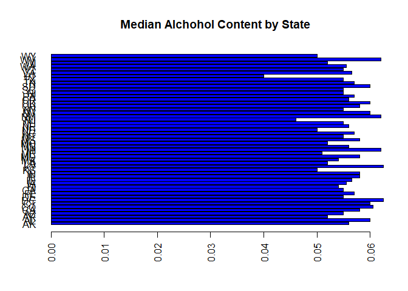

##1 Introduction

The purpose of this documentaton is to provide analysis answers to questions asked by you (the client) related to several different Beers and the Breweries that produce them.

The Environment Information section describes the  software environment and repository location of the data files and code. You should refer to this information should you desire to reproduce this analysis. 

Each subsequent section contains (in order) :  

* A particular question you have asked  

* Methods we used to analyze the data you provided  

* The answer to the question  

---  

## Environment Information  

>  This code block loads the libraries required to process the subsequent code.  


```r
rm(list=ls())
library(ggplot2)
library(readr)
#library(repmis)
#library(RCurl)
library(bitops)
#library(tidyverse)
library(plyr)
```
> This code block displays the hardware, software and thier versions.  


```r
sessionInfo()
```

```
## R version 3.4.2 (2017-09-28)
## Platform: x86_64-pc-linux-gnu (64-bit)
## Running under: Ubuntu 17.10
## 
## Matrix products: default
## BLAS: /usr/lib/x86_64-linux-gnu/blas/libblas.so.3.7.1
## LAPACK: /usr/lib/x86_64-linux-gnu/lapack/liblapack.so.3.7.1
## 
## locale:
##  [1] LC_CTYPE=en_US.UTF-8       LC_NUMERIC=C              
##  [3] LC_TIME=en_US.UTF-8        LC_COLLATE=en_US.UTF-8    
##  [5] LC_MONETARY=en_US.UTF-8    LC_MESSAGES=en_US.UTF-8   
##  [7] LC_PAPER=en_US.UTF-8       LC_NAME=C                 
##  [9] LC_ADDRESS=C               LC_TELEPHONE=C            
## [11] LC_MEASUREMENT=en_US.UTF-8 LC_IDENTIFICATION=C       
## 
## attached base packages:
## [1] stats     graphics  grDevices utils     datasets  methods   base     
## 
## other attached packages:
## [1] plyr_1.8.4    bitops_1.0-6  readr_1.1.1   ggplot2_2.2.1
## 
## loaded via a namespace (and not attached):
##  [1] Rcpp_0.12.15     knitr_1.20       magrittr_1.5     hms_0.4.1       
##  [5] munsell_0.4.3    colorspace_1.3-2 R6_2.2.2         rlang_0.2.0     
##  [9] stringr_1.3.0    tools_3.4.2      grid_3.4.2       gtable_0.2.0    
## [13] htmltools_0.3.6  yaml_2.1.16      lazyeval_0.2.1   rprojroot_1.3-2 
## [17] digest_0.6.15    tibble_1.4.2     evaluate_0.10.1  rmarkdown_1.8   
## [21] stringi_1.1.6    compiler_3.4.2   pillar_1.2.0     scales_0.5.0    
## [25] backports_1.1.2  pkgconfig_2.0.1
```


## Brewery Data Analysis

[Link to the Github Repository Associated with this Study](https://github.com/davxdan/MSDS_6306_DoingDataScience_Case-Study_01)

The purpose of this is to present findings from blah blah ....
The questions asked are listed below with data analysis methods and answers.  

### The Data Provided
Load Beers.csv

```r
RawBeerData <- read_csv("Input/RawDataFiles/Beers.csv")
```

```
## Parsed with column specification:
## cols(
##   Name = col_character(),
##   Beer_ID = col_integer(),
##   ABV = col_double(),
##   IBU = col_integer(),
##   Brewery_id = col_integer(),
##   Style = col_character(),
##   Ounces = col_double()
## )
```
Load Breweries.csv

```r
RawBreweryData <- read_csv("Input/RawDataFiles/Breweries.csv")
```

```
## Parsed with column specification:
## cols(
##   Brew_ID = col_integer(),
##   Name = col_character(),
##   City = col_character(),
##   State = col_character()
## )
```
###1. How many breweries are present in each state?
The record (110,"Woodstock Inn, Station & Brewery",North Woodstock, NH) was causing errors but readr fixed this.
Identify the records:

```r
RawBreweryData[c(110, 111, 112),] #Identified erroneous records
```

```
## # A tibble: 3 x 4
##   Brew_ID Name                             City            State
##     <int> <chr>                            <chr>           <chr>
## 1     110 Woodstock Inn, Station & Brewery North Woodstock NH   
## 2     111 Renegade Brewing Company         Denver          CO   
## 3     112 Mother Earth Brew Company        Vista           CA
```

```r
Stage1BreweryData<- RawBreweryData
Stage1BreweryData <-transform(Stage1BreweryData, State = as.character(State))
```

```r
CountBreweriesByState<-data.frame(Stage1BreweryData$State)
summary(CountBreweriesByState,maxsum=100)
```

```
##  Stage1BreweryData.State
##  AK: 7                  
##  AL: 3                  
##  AR: 2                  
##  AZ:11                  
##  CA:39                  
##  CO:47                  
##  CT: 8                  
##  DC: 1                  
##  DE: 2                  
##  FL:15                  
##  GA: 7                  
##  HI: 4                  
##  IA: 5                  
##  ID: 5                  
##  IL:18                  
##  IN:22                  
##  KS: 3                  
##  KY: 4                  
##  LA: 5                  
##  MA:23                  
##  MD: 7                  
##  ME: 9                  
##  MI:32                  
##  MN:12                  
##  MO: 9                  
##  MS: 2                  
##  MT: 9                  
##  NC:19                  
##  ND: 1                  
##  NE: 5                  
##  NH: 3                  
##  NJ: 3                  
##  NM: 4                  
##  NV: 2                  
##  NY:16                  
##  OH:15                  
##  OK: 6                  
##  OR:29                  
##  PA:25                  
##  RI: 5                  
##  SC: 4                  
##  SD: 1                  
##  TN: 3                  
##  TX:28                  
##  UT: 4                  
##  VA:16                  
##  VT:10                  
##  WA:23                  
##  WI:20                  
##  WV: 1                  
##  WY: 4
```
###2. Merge beer data with the breweries data. Print the first 6 observations and the last six observations to check the merged file.

```r
colnames(Stage1BreweryData) <- c("Brewery_id","BreweryName","City","State")
Stage2<- merge(x= RawBeerData, y=Stage1BreweryData, by = c("Brewery_id"), all=FALSE)
head(Stage2)
```

```
##   Brewery_id          Name Beer_ID   ABV IBU
## 1          1  Get Together    2692 0.045  50
## 2          1 Maggie's Leap    2691 0.049  26
## 3          1    Wall's End    2690 0.048  19
## 4          1       Pumpion    2689 0.060  38
## 5          1    Stronghold    2688 0.060  25
## 6          1   Parapet ESB    2687 0.056  47
##                                 Style Ounces       BreweryName        City
## 1                        American IPA     16 NorthGate Brewing Minneapolis
## 2                  Milk / Sweet Stout     16 NorthGate Brewing Minneapolis
## 3                   English Brown Ale     16 NorthGate Brewing Minneapolis
## 4                         Pumpkin Ale     16 NorthGate Brewing Minneapolis
## 5                     American Porter     16 NorthGate Brewing Minneapolis
## 6 Extra Special / Strong Bitter (ESB)     16 NorthGate Brewing Minneapolis
##   State
## 1    MN
## 2    MN
## 3    MN
## 4    MN
## 5    MN
## 6    MN
```

```r
tail(Stage2)
```

```
##      Brewery_id                      Name Beer_ID   ABV IBU
## 2405        556             Pilsner Ukiah      98 0.055  NA
## 2406        557  Heinnieweisse Weissebier      52 0.049  NA
## 2407        557           Snapperhead IPA      51 0.068  NA
## 2408        557         Moo Thunder Stout      50 0.049  NA
## 2409        557         Porkslap Pale Ale      49 0.043  NA
## 2410        558 Urban Wilderness Pale Ale      30 0.049  NA
##                        Style Ounces                   BreweryName
## 2405         German Pilsener     12         Ukiah Brewing Company
## 2406              Hefeweizen     12       Butternuts Beer and Ale
## 2407            American IPA     12       Butternuts Beer and Ale
## 2408      Milk / Sweet Stout     12       Butternuts Beer and Ale
## 2409 American Pale Ale (APA)     12       Butternuts Beer and Ale
## 2410        English Pale Ale     12 Sleeping Lady Brewing Company
##               City State
## 2405         Ukiah    CA
## 2406 Garrattsville    NY
## 2407 Garrattsville    NY
## 2408 Garrattsville    NY
## 2409 Garrattsville    NY
## 2410     Anchorage    AK
```

###3. Report the number of NA’s in each column.

```r
Brewery_id<-sum(is.na(Stage2$Brewery_id))
Name<-sum(is.na(Stage2$Name))
Beer_ID<-sum(is.na(Stage2$Beer_ID))
ABV<-sum(is.na(Stage2$ABV))
IBU<-sum(is.na(Stage2$IBU))
Style<-sum(is.na(Stage2$Style))
Ounces<-sum(is.na(Stage2$Ounces))
BreweryName<-sum(is.na(Stage2$BreweryName))
City<-sum(is.na(Stage2$City))
State<-sum(is.na(Stage2$State))
NASummary<-as.matrix(c(Brewery_id, Name, Beer_ID, ABV, IBU, Style, Ounces, BreweryName, City, State))
colnames(NASummary)<-c("Count of NA's")
rownames(NASummary) <- c("Brewery_id", "Name", "Beer_ID", "ABV", "IBU", "Style", "Ounces", "BreweryName", "City", "State")
NASummary
```

```
##             Count of NA's
## Brewery_id              0
## Name                    0
## Beer_ID                 0
## ABV                    62
## IBU                  1005
## Style                   5
## Ounces                  0
## BreweryName             0
## City                    0
## State                   0
```

###4. Compute the median alcohol content and international bitterness unit for each state. Plot a bar chart to compare.

```r
  getMedians <- function(x)
  {
  c(median = median(x,na.rm=TRUE ))
  }
ABVMedians<-as.data.frame(tapply(Stage2$ABV, Stage2$State, getMedians))

par(las=2)
barplot(ABVMedians[,1],main ="Median Alchohol Content by State", horiz = FALSE, col = 4)
```

<!-- -->

```r
IBUMedians<-as.data.frame(tapply(Stage2$IBU, Stage2$State, getMedians))

par(las=2)
barplot(IBUMedians[,1],main ="International Bitterness Units by State", horiz = FALSE, col = 4)
```

<!-- -->

###5. Which state has the maximum alcoholic (ABV) beer? Which state has the most bitter (IBU) beer?

```r
MaxABVState<-ddply(Stage2, .(State), summarise, MaxABVState = max(ABV, na.rm=TRUE))
MaxABVState<-MaxABVState[order(MaxABVState$MaxABVState),]
head(MaxABVState,1)
```

```
##   State MaxABVState
## 9    DE       0.055
```

```r
summary(Stage2$ABV)
```

```
##    Min. 1st Qu.  Median    Mean 3rd Qu.    Max.    NA's 
## 0.00100 0.05000 0.05600 0.05977 0.06700 0.12800      62
```

```r
MaxIBUState<-ddply(Stage2, .(State), summarise, MaxIBUState = max(as.double(Stage2$IBU), na.rm=TRUE))
MaxIBUState<-MaxIBUState[order(MaxIBUState$MaxIBUState),]
head(MaxIBUState,1)
```

```
##   State MaxIBUState
## 1    AK         138
```

###6. Summary statistics for the ABV variable.

```r
summary(Stage2$ABV)
```

```
##    Min. 1st Qu.  Median    Mean 3rd Qu.    Max.    NA's 
## 0.00100 0.05000 0.05600 0.05977 0.06700 0.12800      62
```

###7. Is there an apparent relationship between the bitterness of the beer and its alcoholic content? Draw a scatter plot. You are welcome to use the ggplot2 library for graphs. Please ignore missing values in your analysis. Make your best judgment of a relationship and EXPLAIN your answer.

```r
p <- ggplot(Stage2, aes(Stage2$ABV, Stage2$IBU))
p + geom_point(size = 1)
```

```
## Warning: Removed 1005 rows containing missing values (geom_point).
```

<!-- -->

>Formatting Samples  

# Header 1   
## Header 2   
### THis is a header  
#### Header 4   
##### Header 5   
###### Header 6  

--  

---  

...  

$A = \pi*r^{2}$  

  

***  

> block quote  

* unordered list  

* item 2  

Note that the `echo = FALSE` parameter was added to the code chunk to prevent printing of the R code that generated the plot.
